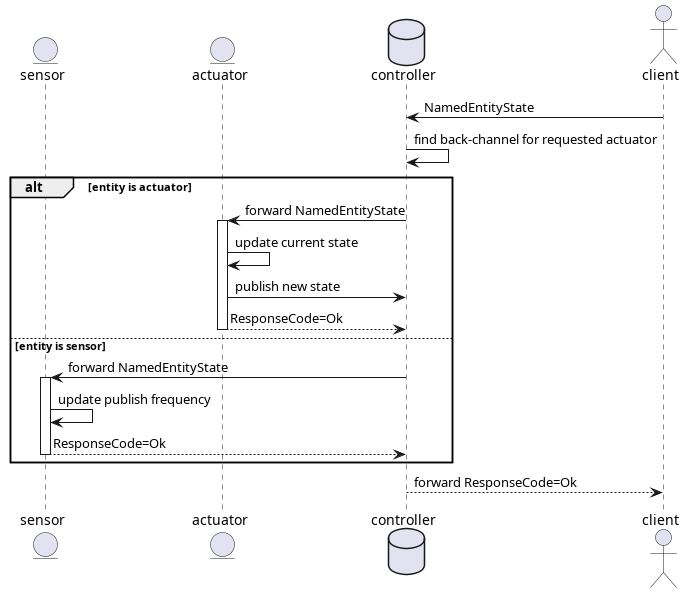

# Architecture

The following communication patterns are used between the individual components:


The following types are used on the communication channels:


All messages are wrapped inside a `PayloadEnvelope` to transfer metadata:

```protobuf
message PayloadEnvelope {
  map<string, string> headers = 1;
  google.protobuf.Any payload = 2;
}
```

# Sensor ⇔ Controller


## Lifecycle management

The sensor __sends__ command __requests__ to register/unregister itself to the controller.

```protobuf
message EntityDiscoveryCommand {
  message Registration { uint32 port = 1; }
  enum EntityType {
    SENSOR = 0;
    ACTUATOR = 1;
  }
  oneof command {
    Registration register = 3;
    google.protobuf.Empty unregister = 4;
    google.protobuf.Empty heartbeat = 5;
  }
  EntityType entity_type = 1;
  string entity_name = 2;
}
```


## Measurement publication

The sensor __publishes__ sensor data in the specified update frequency to the controller.

```protobuf
message SensorMeasurement {
  oneof value {
    TemperatureSensorMeasurement temperature = 1;
    HumiditySensorMeasurement humidity = 2;
  }
  string unit = 3;
}

message TemperatureSensorMeasurement { float temperature = 1; }

message HumiditySensorMeasurement { float humidity = 1; }
```


## Sensor configuration

The sensor can be __requested__ to change the update frequency

```protobuf
message SensorConfiguration { float update_frequency_hz = 1; }

message ResponseCode {
  enum Code {
    OK = 0;
    ERROR = 1;
  }
  Code code = 1;
}
```

# Actuator ⇔ Controller

## Lifecycle management

Just like the sensor, the actuator __sends__ command __requests__ to register/unregister itself to the controller.

## State publication
Just like the sensor, the actuator __publishes__ its state to the controller periodically.

## Actuator state update

The controller can __request__ the actuator to change its state.

```protobuf
message ActuatorState {
  oneof state {
    LightActuatorState light = 1;
    AirConditioningActuatorState air_conditioning = 2;
  }
}

message LightActuatorState { float brightness = 1; }

message AirConditioningActuatorState { bool on = 1; }
```

# Controller ⇔ Client

## System state query

The client can __request__ the current state of the system, including active sensors/actuators, sensor values, and actuator states from the client.

```protobuf
message SystemStateQuery {}

message SystemState {
  map<string, SensorMeasurement> sensors = 1;
  map<string, ActuatorState> actuators   = 2;
  repeated string new_sensors = 3;
  repeated string new_actuators = 4;
}
```


## Configuration and update

The client can __request__ the system to set an actuator target value or the sensor update frequency (the request is forwarded to the actuator/sensor).

```protobuf
message NamedEntityState {
  string entity_name = 1;
  oneof state {
    SensorConfiguration sensor_configuration = 2;
    ActuatorState actuator_state = 3;
  }
}
```




# Usage

1. Start a shell with all required programs by running `nix-shell` on the top-level directory.
2. Start tracing aggregator with `zipkin-server`. Traces will be available at <http://localhost:9411/zipkin/>
3. Start the programs:
    1. Start the controller via `cargo run --bin home_automation_controller`
    2. Start the client via `cargo run --bin home_automation_client`
	3. Spawn sensor and actuators via:
	  - `cargo run --bin sensor -- <NAME> <[Humidity|Temperature]>` for a single sensor
      - `cargo run --bin actuator -- <NAME> <[AirConditioning|Light]>` for a single actuator
	  - `./spawn-entities <N>` for `N` random sensors and actuators